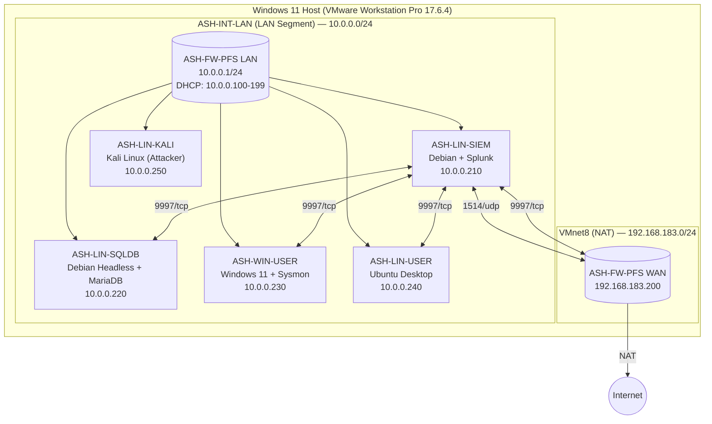

# SIEM Detection Lab - for Threat Hunting & MITRE ATT&CK Simulation

## 1. Executive Summary

This project documents an end-to-end threat detection lab built using **Splunk SIEM**, and other free, commercially available tooling. It includes the detailed configurations and logging setup for 6 network devices, including walkthroughs for configuring the Splunk Universal Forwarder (SUF). 

Once the network infrastructure is configured and baseline VM snapshots are created, we can focus on threat simulation & detection. In this lab, 5+ MITRE ATT&CK techniques are simulated across both Windows and Linux endpoints. The corresponding Splunk (SPL) detection logic is documented and implemented as custom alert rules to identify, monitor, and alert on simulated attacker activity.

## 2. Network Architecture & Topology Diagram

This project documents an end-to-end threat detection lab built using free, commercially available tooling. The environment is hosted on-prem on a single Windows 11 Home machine using VMware Workstation Pro as the Type-2 hypervisor. 

The lab consists of 6 virtual machines (VMs) in total. 
- The network firewall (`ASH-FW-PFS`) separates the network into a LAN-side and WAN-side.
- The LAN interface leads to a flat internal network (`ASH-INT-LAN`, 10.0.0.0/24) consisting of 5 endpoint VMs.
- The WAN interface (`NAT`, 192.168.183.200/24) leads out to the public internet through VMware Workstation's NAT (`VMnet8`) network.

DNS Resolution: 
- All internal hosts resolve through the pfSense DNS Resolver service at 10.0.0.1.
- External resolution forwards to Google DNS (8.8.8.8, 8.8.4.4).

| # | Device Name        | Description         |  OS                                   | LAN IP          | WAN IP               | Notes                                              |
| - | ------------------ | ----------------    | --------------------                  | --------------- | -------------------- | -------------------------------------------------- |
| 1 | **ASH-FW-PFS**     | Network Firewall    | pfSense CE (2.8.1)                    | `10.0.0.1/24`   | `192.168.183.200/24` | Syslog (RFC 5424), Suricata IDS (eve.json)         |
| 2 | **ASH-LIN-SIEM**   | Splunk SIEM Server  | Linux Debian (GNU/Linux 13, GUI)      | `10.0.0.210/24` |                      | UFW, Splunk Enterprise / Free, rsyslog             |
| 3 | **ASH-LIN-SQLDB**  | SQLDB Server        | Linux Debian (GNU/Linux 13, Headless) | `10.0.0.220/24` |                      | UFW, MariaDB, rsyslog, SUF                         |
| 4 | **ASH-WIN-USER**   | Windows Workstation | Windows 11 Enterprise                 | `10.0.0.230/24` |                      | Sysmon (SwiftOnSecurity Config), Sysinternals, SUF |
| 5 | **ASH-LIN-USER**   | Linux Workstation   | Linux (Ubuntu 24.04.4 LTS)            | `10.0.0.240/24` |                      | UFW, rsyslog, SUF                                  |
| 6 | **ASH-LIN-KALI**   | Linux Attackbox     | Linux Kali Xfce (GNU/Linux 2026.1)    | `10.0.0.250/24` |                      |                                                    |

## 3. Lab Setup and Device Configuration
### *3.1. Hypervisor - VMware Workstation Pro*

Why choose VMware Workstation Pro compared to other Type-2 Hypervisors?
- **Hyper-V:** Unavailable on Windows 11 Home without a Pro license upgrade.
- **VirtualBox:** Familiar but skipped to gain experience with the VMware ecosystem (relevant to enterprise vSphere environments).
- **VMware Workstation Pro:** Chosen because Broadcom made it free for personal use. Version 17.6.4 (Build 24832109) was downloaded and hash-verified via PowerShell (`Get-FileHash` with SHA256 and MD5).

Host Preparation: 
- Enabled **Windows Hypervisor Platform** in Windows Features (required for Workstation Pro on Win11).
- Rebooted host to apply changes.

Virtual Networking: 
- **NAT (`VMnet8`):** `192.168.183.0/24`. Assigned to the firewall’s WAN adapter.
- **LAN Segment (`ASH-INT-LAN`):** Custom segment created in Workstation. All internal VMs (except the firewall’s WAN) attach here.
- 
**Snapshot Strategy**
A three-tier snapshot methodology was adopted across all VMs:
1. **Base-Snapshot:** OS installed, initial hardening, users created.
2. **Base-Snapshot-2:** Static IP assigned, IPv6 disabled, host firewall enabled, logging configured.
3. **Base-Snapshot-3:** Pre-detection baseline. All logs verified flowing into correct Splunk indexes.

### *3.2. Network Firewall - ASH-FW-PFS (pfSense)*

Installation & Initial Configuration: 
- OS: pfSense Plus Community Edition (FreeBSD-based).
- Interfaces: `em0` = WAN; `em1` = LAN.
- LAN Setup: Static IPv4 `10.0.0.1/24`; Kea DHCP enabled (`10.0.0.100`–`199`).
- Hostname: `ASH-FW-PFS`; Domain: `lab.internal`.
- Time: UTC (`Etc/UTC`); NTP: `2.pfsense.pool.ntp.org`.
- Admin Portal: Default credentials (`admin` / `pfsense`) changed during wizard; later disabled entirely.

Hardening: 
- Disabled IPv6 globally (`System > Advanced > Networking`): unchecked “Allow IPv6”.
- Disabled DHCPv6 and Router Advertisements on LAN.
- Changed DHCP server backend from deprecated ISC DHCP to **Kea DHCP**.
- Created non-default admin user `ash` (group: `admins`); disabled login for default user `admin`.
- Enabled SSH access with `Password or Public Key` (port 22).

