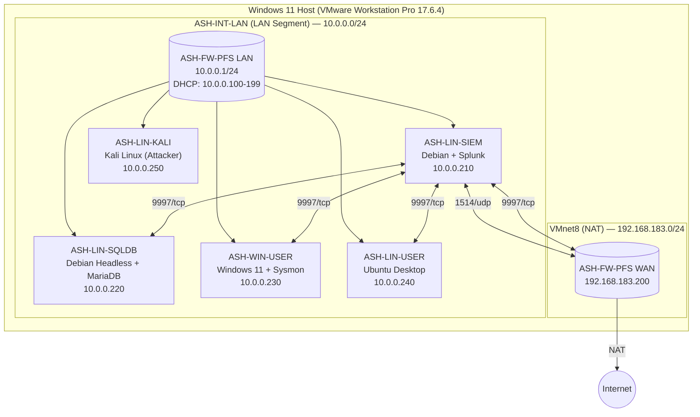

# SIEM Detection Lab - for Threat Hunting & MITRE ATT&CK Simulation

## Table Of Contents: 
1. Executive Summary
2. Network Architecture & Topology Diagram
3. Lab Setup and Device Configuration
4. Data Ingestion & Indexing Summary
5. Detection Engineering & Alert Rules
6. Lessons Learned & Best Practices
7. Appendix

## 1. Executive Summary

This project documents an end-to-end threat detection lab built using **Splunk SIEM**, and other free, commercially available tooling. It includes the detailed configurations and logging setup instructions for 6 network devices, including walkthroughs for configuring the Splunk Universal Forwarder (SUF). 

Once the network infrastructure is configured and baseline VM snapshots are created, we can focus on threat simulation & detection. In this lab, 5+ MITRE ATT&CK techniques are simulated across both Windows and Linux endpoints. The corresponding Splunk (SPL) detection logic is documented and implemented as custom alert rules to identify, monitor, and alert on simulated attacker activity.

## 2. Network Architecture & Topology Diagram

This project documents an end-to-end threat detection lab built using free, commercially available tooling. The environment is hosted on-prem on a single Windows 11 Home machine using VMware Workstation Pro as the Type-2 hypervisor. 

The lab consists of 6 virtual machines (VMs) in total. 
- The network firewall (`ASH-FW-PFS`) separates the network into a LAN-side and WAN-side.
- The LAN interface leads to a flat internal network (`ASH-INT-LAN`, 10.0.0.0/24) consisting of 5 endpoint VMs.
- The WAN interface (`NAT`, 192.168.183.200/24) leads out to the public internet through VMware Workstation's NAT (`VMnet8`) network.

DNS Resolution: 
- All internal hosts resolve through the pfSense DNS Resolver service at 10.0.0.1.
- External resolution forwards to Google DNS (8.8.8.8, 8.8.4.4).

| # | Device Name        | Description         |  OS                                   | LAN IP          | WAN IP               | Notes                                              |
| - | ------------------ | ----------------    | --------------------                  | --------------- | -------------------- | -------------------------------------------------- |
| 1 | **ASH-FW-PFS**     | Network Firewall    | pfSense CE (2.8.1)                    | `10.0.0.1/24`   | `192.168.183.200/24` | Syslog (RFC 5424), Suricata IDS (eve.json)         |
| 2 | **ASH-LIN-SIEM**   | Splunk SIEM Server  | Linux Debian (GNU/Linux 13, GUI)      | `10.0.0.210/24` |                      | UFW, Splunk Enterprise / Free, rsyslog             |
| 3 | **ASH-LIN-SQLDB**  | SQLDB Server        | Linux Debian (GNU/Linux 13, Headless) | `10.0.0.220/24` |                      | UFW, MariaDB, rsyslog, SUF                         |
| 4 | **ASH-WIN-USER**   | Windows Workstation | Windows 11 Enterprise                 | `10.0.0.230/24` |                      | Sysmon (SwiftOnSecurity Config), Sysinternals, SUF |
| 5 | **ASH-LIN-USER**   | Linux Workstation   | Linux (Ubuntu 24.04.4 LTS)            | `10.0.0.240/24` |                      | UFW, rsyslog, SUF                                  |
| 6 | **ASH-LIN-KALI**   | Linux Attackbox     | Linux Kali Xfce (GNU/Linux 2026.1)    | `10.0.0.250/24` |                      |                                                    |

## 3. Lab Setup and Device Configuration
## *3.1. Hypervisor - VMware Workstation Pro*

Why choose VMware Workstation Pro compared to other Type-2 Hypervisors?
- Hyper-V: Unavailable on Windows 11 Home without a Pro license upgrade.
- VirtualBox: Familiar but skipped to gain experience with the VMware ecosystem (relevant to enterprise vSphere environments).
- VMware Workstation Pro: Chosen because Broadcom made it free for personal use. Version 17.6.4 (Build 24832109) was downloaded and hash-verified via PowerShell (`Get-FileHash` with SHA256 and MD5).

Host Setup: 
- Enabled Windows Hypervisor Platform in Windows Features (required for Workstation Pro on Win11).
- Rebooted host to apply changes.

Virtual Networking: 
- NAT (`VMnet8`): `192.168.183.0/24`. Assigned to the firewall’s WAN adapter.
- LAN Segment (`ASH-INT-LAN`): Custom segment created in Workstation. All internal VMs (except the firewall’s WAN) attach here.

Snapshot Strategy:
A three-tier snapshot methodology was adopted across all VMs:
1. Base-Snapshot: OS installed, initial hardening, users created.
2. Base-Snapshot-2: Static IP assigned, IPv6 disabled, host firewall enabled, logging configured.
3. Base-Snapshot-3: Pre-detection baseline. All logs verified flowing into correct Splunk indexes.

## *3.2. Network Firewall - ASH-FW-PFS (pfSense)*

Host Setup: 
- OS: pfSense Plus Community Edition 2.8.1 (FreeBSD 15.0).
- Interfaces: `em0` = WAN; `em1` = LAN.
- LAN Setup: Static IPv4 `10.0.0.1/24`; Kea DHCP enabled (IP Range `10.0.0.100`-`199`).
- Hostname: `ASH-FW-PFS`; Domain: `lab.internal`.
- Time: UTC (`Etc/UTC`); NTP: `2.pfsense.pool.ntp.org`.
- Admin Portal: Default credentials (`admin` / `pfsense`) changed during wizard; later disabled entirely.

Hardening: 
- Disabled IPv6 globally (`System > Advanced > Networking`): unchecked “Allow IPv6”.
- Disabled DHCPv6 and Router Advertisements on LAN.
- Changed DHCP server backend from deprecated ISC DHCP to **Kea DHCP**.
- Created non-default admin user `ash` (group: `admins`); disabled login for default user `admin`.
- Enabled SSH access with `Password or Public Key` (port 22).

Firewall Rules (LAN):
| Rule | Protocol | Source | Destination | Port | Action | Status |
|---|---|---|---|---|---|---|
| Anti-Lockout | * | * | LAN Address | 443, 80, 22 | Allow | Enabled |
| Default Allow LAN | * | * | * | * | Allow | Enabled |
| Default Allow LAN IPv6 | * | * | * | * | Allow | Block | Disabled |

Firewall Rules (WAN):
- No custom rules defined for this interface.
- By default, all incoming connections on this interface will be blocked until pass rules are added. 

Suricata IDS:
- Installed Suricata package (`v7.0.8_5`) and Open-VM-Tools.
- Disabled Hardware Checksum Offloading, TCP Segmentation Offloading, and Large Receive Offloading (`System > Advanced > Networking`) to prevent Suricata packet loss.
- Added an Oinkcode for Snort rule updates.
- Enabled Suricata on both WAN and LAN in IDS (legacy) mode.
- WAN: IPS intentionally disabled to avoid self-lockout during testing.
- Troubleshooting: During setup, the firewall crashed due to swap memory exhaustion (caused by enabling too many rules). This issue was resolved by changing the Firewall VM's RAM from 1GB to 2GB, and selecting a limited ruleset (ET Open + essential categories only). 

Enable Firewall Logging and Forward Logs to SIEM:
1. *Syslog (pfSense system / firewall logs):*
   - Syslog format changed from BSD (RFC 3164) to syslog (RFC 5424) for enhanced compatibility with 'TA-pfsense' plugin.
   - Remote logging enabled and configured to forward logs to `10.0.0.210:1514/udp` (i.e. Port 1514 on the SIEM server).
     - Note: Port `514` is the default for Syslog. However, I used a non-standard port `1514` (i.e. not in `0-1024` range) instead because Splunk is running as a non-root underprivileged `splunk` user on the firewall, which doesn't have permissions to modify assignments for well known ports (`0-1024`).
   - Splunk input configured: sourcetype=`pfsense`, index=`pfsense`.
   - Installed TA-pfsense add-on on Splunk to normalize sourcetypes.

2. *Suricata EVE JSON (IDS alerts):*
   - Logs written to `/var/log/suricata/`.
   - Installed Splunk Universal Forwarder (SUF) on the firewall.
   - Created `splunk` service user and group on pfSense.
   - Used `setfacl` to grant `splunk` user read/execute access to `/var/log/suricata`.
   - Updated the inputs.conf, outputs.conf, props.conf, and transforms.conf files to reduce & tune-out log noise.
   - Monitors configured in `inputs.conf`:
     - `[monitor:///var/log/suricata/suricata_em051045/eve.json*]` → `index=suricata`, `sourcetype=suricata:wan`
     - `[monitor:///var/log/suricata/suricata_em144243/eve.json*]` → `index=suricata`, `sourcetype=suricata:lan`
   - `outputs.conf` points to `10.0.0.210:9997` (i.e. Port 9997 on the SIEM server). 
   - Added Shellcmd package to auto-start Splunk Forwarder on boot (`/opt/splunkforwarder/bin/splunk start`).
   - Added Shellcmd package to restart `syslogd` service on boot (`/usr/sbin/service/syslogd restart`) to ensure syslog forwarding persists upon firewall reboot.

## *3.3. SIEM Server - ASH-LIN-SIEM (Splunk Enterprise)*

Host Setup: 
- OS: Linux Debian (GNU/Linux 13, GUI with GNOME).
- User: ash (sudoers group).
- Static IP: `10.0.0.210/24`, Gateway: `10.0.0.1`, DNS: `10.0.0.1`.
- IPv6: Disabled via `sysctl`.

Host Firewall Rules (UFW): 
- `sudo ufw allow in 9997/tcp` — Splunk Forwarder data ingress.
- `sudo ufw allow in from 10.0.0.1 to any port 1514 proto udp` — Syslog from firewall.
- Port `8000/tcp` (Splunk Web UI) and `8089/tcp` (Splunkd management) intentionally left closed to LAN to reduce attack surface; UI accessed locally on the SIEM server only.
- Default deny incoming; default allow outgoing.

Splunk Enterprise Installation:
- Version: Splunk Enterprise `10.2.3` (`.deb` package).
- Install Path: `/opt/splunk`.
- Service Account: `splunk` user/group owns `/opt/splunk`.
- Admin Credentials: `siemadmin` / `companysplunk`.
- Boot Start: `sudo /opt/splunk/bin/splunk enable boot-start -user splunk`.
- Receiving: Enabled on port `9997/tcp` (`Splunk UI > Settings > Forwarding and Receiving`).

Indexing Strategy in Splunk:
| # | Index | Purpose | Sources |
| - |---|---|---|
| 1 | `pfsense` | Firewall (syslog) | `ASH-FW-PFS` |
| 2 | `suricata` | IDS (eve.json) | `ASH-FW-PFS` (WAN & LAN Interfaces) |
| 3 | `linux` | Linux OS | `ASH-LIN-USER`, `ASH-LIN-SQLDB` |
| 4 | `windows` | Windows OS / Sysmon | `ASH-WIN-USER` |
| 5 | `_audit` | Splunk Internal Auditing | `ASH-LIN-SIEM` |

Add-ons Installed:
- Splunk Add-on for Unix and Linux (`Splunk_TA_nix`): Deployed on forwarders and SIEM for field extraction.
- TA-pfsense: For pfSense log parsing and sourcetype assignment.

Quality of Life & Troubleshooting:
- Installed `tcpdump` to verify packet flow on ports `1514` and `9997`.
- Used `dbinspect` and `eventcount` SPL commands to monitor index sizes and event counts.
- Cleaned old event data and removed deprecated indexes to prevent double-ingestion and storage bloat.
  - `sudo /opt/splunk/bin/splunk clean eventdata -index index_name` 

## *3.4. Linux Workstation - ASH-LIN-USER (Ubuntu)*

Host Setup: 
- OS: Linux Ubuntu Desktop 24.04.4 LTS (64-bit).
- User: joej (sudoers group).
- Username: Joe Johnson.
- Static IP: `10.0.0.20/24`, Gateway: `10.0.0.1`, DNS: `10.0.0.1`.
- IPv6: Disabled.
- Tools Installed: `curl`, `vim`, `net-tools`, `traceroute`, `wget`, `htop`, `tcpdump`, `openssh-server`, `python3`, `python3-pip`, `mousepad`.
- Power Settings: Screen blank set to Never; automatic screen lock disabled.

Host Firewall Rules (UFW): 
- Explicit outbound rule: `sudo ufw allow out to 10.0.0.210 port 9997 proto tcp` (Splunk Forwarder egress).
- Default deny incoming; default allow outgoing.

Logging: 
- `rsyslog` enabled and running.
- Verified log files: `/var/log/auth.log`, `/var/log/syslog`, `/var/log/kern.log`.

Splunk Universal Forwarder (SUF) Setup: 
- Installed Splunk Universal Forwarder (SUF).
- Version: `10.2.3` Linux AMD64.
- Service Account: `splunkfwd`.
- Credentials: `splunkfw`.
- Boot Start: Enabled.
- Permissions: `setfacl` used to grant service user `splunkfwd` read access to `/var/log/`.
- Add-on: `Splunk_TA_nix` installed in `/opt/splunkforwarder/etc/apps/`.
- Updated the inputs.conf, outputs.conf, props.conf, and transforms.conf files to reduce & tune-out log noise.
- Monitors configured in `default/inputs.conf` with `sourcetype=linux` and `disabled=0`:
  - `[monitor:///var/log]` (file monitors)
  - `[script://./bin/netstat.sh]` (network connections)
  - `[script://./bin/who.sh]` (logged-in users)
  - `[script://./bin/openPorts.sh]` (open ports)
- `outputs.conf` points to `10.0.0.210:9997` (i.e. Port 9997 on the SIEM server).

Tuning Notes: 
- Disabled `ps.sh` monitoring after discovering it generated ~30% of total Linux index volume (13,280 events in a 15-minute window). Tuned `inputs.conf` to reduce noise.

## *3.5. Windows Workstation - ASH-WIN-USER (Windows 11 Enterprise)*

Host Setup: 
- OS: Windows 11 Enterprise.
- User: Jessica Wood
- Workgroup: WORKGROUP (no Active Directory domain).
- Static IP: `10.0.0.230/24`, Gateway: `10.0.0.1`, DNS: `10.0.0.1`.
- IPv6: Disabled.
- Windows Security: Virus & Threat Protection enabled; App & Browser Control enabled.
- Power: Screen off (never); Power mode (best performance).
- Tools: Sysinternals Suite, Notepad++, Visual Studio Code.

Windows Defender Firewall: 
- Private profile active.
- Outbound Rule: Splunk Forwarder - Allow TCP out to remote IP `10.0.0.210` on Port `9997`.

Sysmon: 
- Installed using SwiftOnSecurity configuration.
- Key Event IDs for Detection:
 - `1` - Process Creation (CommandLine, hashes, parent process).
 - `2` - Network Connection
 - `3` - Create Remote Thread (injection)
 - `10` - Process Access (one process opens another)
 - `11` - File Creation
 - `12` / `13` - Registry Add/Delete/Set
 - `22` - DNS Query

Splunk Universal Forwarder (SUF) Setup:
- Service Account: `splunkfwd`
- Credentials: `splunkfw` / `xxxxxxxxxx`
- Add-ons:
  - Splunk Add-On for Microsoft Windows (Splunk_TA_Windows):
  - Splunk Add-On for Sysmon:
- Permission Fix: The splunkfwd service account was explicity granted read access to the Sysmon Operational channel to resolve `ErrorCode=5 (ACCESS DENIED)` in `splunkd.log`.
- Props.conf Tuning: On the SIEM server `ASH-LIN-SIEM`, commented out `#rename = XmlWinEventLog` lines in `props.conf` to prevent sourcetype conflicts. 

## *3.6. SQLDB Server - ASH-LIN-SQLDB (Linux Debian, Headless)*

Host Setup:
- OS: Linux Debian (GNU/Linux 13; headless, no GUI).
- User: itadmin (sudoers group).
- Static IP: `10.0.0.220/24`, Gateway: `10.0.0.1`, DNS: `10.0.0.1`.
- Network Config: Static IP assignment via `/etc/network/interfaces` (`ens33`). 
- IPv6: Disabled via `sysctl`.

Host Firewall Rules (UFW): 
- Outbound rule to SIEM: `sudo ufw allow out to 10.0.0.210 port 9997 proto tcp`.
- SSH (`22/tcp`) temporarily enabled during setup, then removed.
- MariaDB port (`3306/tcp`) reserved for future application connectivity.

Database: 
- MariaDB installed and service enabled.
- Future plans:
  - Populate a "Bakery" sample database (with inventory and customer tables.
  - Enable MariaDB Audit Plugin and General Query Logs for SQL injection detection.

Logging & Forwarder: 
- `rsyslog` enabled; logs verified at `/var/log/auth.log`, `/var/log/syslog`, `/var/log/kern.log`.
- Splunk Universal Forwarder installed with service account `splunkfw` / `xxxxxxxxxx`.
- `Splunk_TA_nix` deployed via SCP and configured for `index=linux`.
- `setfacl` used to grant service account `splunkfwd` with read permissions to `/var/log/`.

## *3.7. Kali Linux Attackbox - ASH-LIN-KALI (Simulating Attacker Machine on Internal Network)*

Host Setup: 
- OS:
- User: ghostly
- Static IP: `10.0.0.250/24`, Gateway: `10.0.0.1`, DNS: `10.0.0.1`.
- IPv6: Disabled

Attacker Tooling: 
- nmap, metasploit-framework, burpsuite, wireshark.

Design Decisions (for Red Team realism): 
- No Splunk Forwarder: SUF intentionally omitted, because in a real intrusion, an attacker would not forward their own logs to the victim’s SIEM. As such, detection must rely on artifacts left on target systems.
- No Host Firewall (UFW): Host-based firewalls interfere with reverse-shells, netcat (nc) listeners, and certain scanning techniques. It is standard for dedicated attack VM's in lab environments to keep UFW disabled.

Post-Install Fix: 
- Keyboard stopped functioning after an upgrade. Resolved by adding `i8042.nomux=1` to the GRUB boot parameter and persisting it in `/etc/default/grub` followed by `update-grub`.

## 4. Data Ingestion & Indexing Summary
| Source        | Log Type                   | Transport         | Splunk Index | Sourcetype                           |
| ------------- | -------------------------- | ----------------- | ------------ | ------------------------------------ |
| ASH-FW-PFS    | System / Firewall / DHCP   | Syslog UDP `1514` | `pfsense`    | `pfsense:*`                          |
| ASH-FW-PFS    | Suricata EVE JSON          | SUF TCP `9997`    | `suricata`   | `suricata:wan`, `suricata:lan`       |
| ASH-LIN-USER  | auth, syslog, kern, audit  | SUF TCP `9997`    | `linux`      | `syslog`, `linux_audit`, `who`, etc. |
| ASH-LIN-SQLDB | auth, syslog, kern         | SUF TCP `9997`    | `linux`      | `syslog`, etc.                       |
| ASH-WIN-USER  | Security, System, Sysmon   | SUF TCP `9997`    | `windows`    | `XmlWinEventLog:*`                   |

## 5. Detection Engineering & Alert Rules

All rules are implemented in Splunk Enterprise as scheduled alerts running on a 5-minute cron schedule (`* /5 * * * *`). 
- 24 hr expiration (default). 
- Throttling enabled per `host` for 15 minutes (to prevent duplicate alerts and reduce alert fatigue). 

Tuning Notes: In the future, implement *lookup-based allowlists (with version control)* instead of hardcoded exclusions in SPL (for whitelisting and tuning out false positives).

## *5.1. T1110 - Brute Force*

- Rule Name: Failed Login Attempts  
- MITRE ATT&CK: T1110 (Brute Force), T1110.001 (Password Guessing), T1110.003 (Password Spraying)  
- Description: Invalid username or password (more than 3 failed attempts in 10 minutes).
- Severity: Medium
- SPL Query: 
 - `(index=pfsense source="pfsense" "authentication error") OR (index=linux source="/var/log/auth.log" "authentication failure") OR (index=windows source="XmlWinEventLog:Security" EventID="4625")`
- Trigger Condition & Frequency: Number of results > 3; For each result. 
- Throttling: Suppress results containing field value `host` for 15 minutes.

## *5.2. T1078.001 - Valid Accounts: Default Accounts*

- Rule Name: Login Attempt Using Factory Default Credentials
- MITRE ATT&CK: T1078 (Valid Accounts), T1078.001 (Default Accounts)    
- Description: Attempted logon using factory default credentials (username). 
  - For firewall (admin, pfsense).
  - For linux hosts (debian, ubuntu, admin, user, root).
  - For windows hosts (admin, administrator, guest, localhost). 
- Severity: Medium
- SPL Query: 
 - `(index=pfsense sourcetype="pfsense" ("user admin" OR "Authentication error for admin" OR "for user 'admin'")  OR ("user pfsense" OR "Authentication error for pfsense" OR "for user 'pfsense'")) 
    OR (index=linux source="/var/log/auth.log" ("debian" OR "ubuntu" OR "admin" OR "user=user" OR "user user") OR ("fail" AND "root") OR ("new session" AND "root"))
    OR (index=windows source="XmlWinEventLog:Security" (EventID=4624 OR EventID=4625 OR EventID=4648 OR EventID=4672) (user="admin*" OR user="guest" OR user="localhost"))`
- Trigger Condition & Frequency: Number of results > 0; For each result. 
- Throttling: Suppress results containing field value `host` for 15 minutes.

Notes on Windows Event IDs:
- `4624` — Successful Logon
- `4625` — Failed Logon
- `4648` — Logon using explicit credentials (runas, scheduled tasks, lateral movement)
- `4672` — Special privileges assigned (admin-level logon)

## *5.3. T1059 - Command & Scripting Interpreter*

Three (3) separate alerts cover PowerShell, Windows Command Shell, and Unix Shell.

### *5.3.1. T1059.001 - PowerShell*

- Rule Name: Suspicious Command or Script Execution (Powershell)
- Description: Potentially malicious command or script executed (Windows Powershell) (T1059.001). 
  - Keywords: bypass, unrestricted, hidden, noprof, encodedcommand, executionpolicy, invoke-webrequest, invoke-restmethod, downloadstring, downloadfile, iex, invoke-expression, invoke-command, start-process, add-type, frombase64string, base64, invoke-mimikatz, invoke-shellcode, invoke-reflectivepeinjection.
- Severity: Medium
- SPL Query:
  - `index=windows source="XmlWinEventLog:Microsoft-Windows-Powershell/Operational" EventID=4104 | eval CommandLine = coalesce(CommandLine, ScriptBlockText) | where match(CommandLine,"(?i)(bypass|unrestricted|hidden|noprof|encodedcommand|executionpolicy|invoke-webrequest|invoke-restmethod|downloadstring|downloadfile|iex|invoke-expression|invoke-command|start-process|add-type|frombase64string|base64|invoke-mimikatz|invoke-shellcode|invoke-reflectivepeinjection)")`
- Trigger Condition & Frequency: Number of results > 0; For each result. 
- Throttling: Suppress results containing field value `host` for 15 minutes.
- Notes:
  - Enable Powershell Script Block Logging (WinEvent ID `4104`) using Local Group Policy Editor to have visibility of Powershell commands that don't directly spawn a new process per Sysmon Event ID `1`. 
  - `ScriptBlockText` field normalized to `CommandLine` field using `eval` and `coalesce` commands in SPL.

### *5.3.2. T1059.003 - Windows Command Shell*

- Rule Name: Suspicious Command or Script Execution (Cmd Shell)
- Description: Potentially malicious command or script executed (Windows Command Shell) (T1059.003).
  - Keywords: cmd.exe /ckqsuv, comspec, .bat, .cmd, \tmp\*\.bat.
- Severity: Medium
- SPL Query:
  - `index=windows source="XmlWinEventLog:Microsoft-Windows-Sysmon/Operational" EventID=1 | where match(Image,"(?i)\\cmd\\.exe$") | where match(CommandLine,"(?i)(?:/(?:c|k|q|s|u|v)|\bcomspec\b|%comspec%|\.bat\b|\.cmd\b|\\temp\\.*\.bat)") | where match(ParentImage,"(?i)\\b(?:rundll32|mshta|regsvr32|schtasks|psexec|wmic|wscript|cscript|powershell)(?:\\.exe)?$")`
- Trigger Condition & Frequency: Number of results > 0; For each result. 
- Throttling: Suppress results containing field value `host` for 15 minutes.

### *5.3.3. T1059.004 - Unix Shell*

- Rule Name: Suspicious Command or Script Execution (Unix Shell)
- Description: Potentially malicious command or script executed (Unix Shell) (T1059.004).
  - Keywords: bash -c, sh -c, python -c, perl -e, php -r, nc, ncat, socat, /dev/tcp, base64 -d, xxd -r.
- Severity: Medium
- SPL Query:
  - `index=linux source="/var/log/audit/audit.log" sourcetype="linux_audit" type=EXECVE | where match(_raw,"(?i)(bash -c|sh -c|python -c|perl -e|php -r|nc .* -e|ncat .* -e|socat .*tcp|/dev/tcp|base64 -d|xxd -r)") 
OR (match(_raw,"(?i)(/tmp|/var/tmp|/dev/shm)") AND match(_raw,"(?i)\\b(bash|sh|python|perl|php|nc|ncat|socat)\\b"))`
- Trigger Condition & Frequency: Number of results > 0; For each result. 
- Throttling: Suppress results containing field value `host` for 15 minutes.

## *5.4. T1021 - Remote Services*

Three separate alerts cover RDP, SMB, and SSH.

### *5.4.1. T1021.001 - Remote Services (RDP)*

- Rule Name: Remote Login Attempt (Windows)
- Description: Remote login attempt detected over RDP (Port 3389).
- Severity: Medium
- SPL Query:
  - `index=windows source="XmlWinEventLog:Security" (EventID=4624 OR EventID=4625) (LogonType=3 OR LogonType=10)`
- Trigger Condition & Frequency: Number of results > 0; For each result. 
- Throttling: Suppress results containing field value `host` for 15 minutes.
- Notes: Need to enable Remote Desktop on Windows endpoint to simulate & test this detection. 

### *5.4.2. T1021.002 - SMB / Windows Admin Shares*

- Rule Name: Remote Access to Windows Administrative Shares (SMB)
- Description: See remote logons (EventID=4624, LogonType=3) and access / activity for Windows administrative shares (C$, ADMIN$, IPC$).
- Severity: Medium
- SPL Query:
  - `index=windows source="XmlWinEventLog:Security" (EventID=4624 OR EventID=5140 OR EventID=5145) | eval is_admin_share = if(match(ShareName,"(?i)\\\\(C\$|ADMIN\$|IPC\$)"),1,0) | where (EventID=4624 AND LogonType=3) OR is_admin_share=1`
- Trigger Condition & Frequency: Number of results > 0; For each result. 
- Throttling: Suppress results containing field value `host` for 15 minutes.
- Notes: On the Windows endpoint, Need to enable 'File & Printer Sharing', allow local administrator accounts to authenticate remotely over SMB (see Powershell command below), and enable Object Access Auditing to enable logging for Event IDs `5140` & `5415` in order to simulate & test this detection.
  - Powershell (as admin): `reg add "HKLM\SOFTWARE\Microsoft\Windows\CurrentVersion\Policies\System" /v LocalAccountTokenFilterPolicy /t REG_DWORD /d 1 /f`

### *5.4.3. T1021.004 - Remote Services (SSH)*

- Rule Name: Remote Login Attempt (Linux)
- Description: Remote login attempt detected over SSH (Port 22, Linux).
- Severity: Medium
- SPL Query:
  - `index=linux source="/var/log/auth.log" (("Accepted password" OR "Failed password") AND "ssh*")`
- Trigger Condition & Frequency: Number of results > 0; For each result. 
- Throttling: Suppress results containing field value `host` for 15 minutes.
- Notes: Need to enable SSH on Linux endpoint to simulate & test this detection. 

## *5.6. T1003 - Credential Dumping*

- Rule Name: Mimikatz or Credential Dumping Detected by Windows Defender
- Description: Event ID 1116 (malware detected); Event ID 1117 (malware action taken - quarantine/delete).
  - Searching for Threat_Name = mimikatz, credential, dump.
- Severity: Critical
- SPL Query:
  - `index=windows source="XmlWinEventLog:Microsoft-Windows-Windows Defender/Operational" (EventID=1116 OR EventID=1117) | search (Threat_Name="*mimikatz*" OR Threat_Name="*credential*" OR Threat_Name="*dump*")`
- Trigger Condition & Frequency: Number of results > 0; For each result. 
- Throttling: Suppress results containing field value `host` for 15 minutes.
- Notes: Need to enable SSH on Linux endpoint to simulate & test this detection. 

## *5.7. Windows Defender Malware Detected*

- Rule Name: Malware Detected by Windows Defender
- Description: Event ID 1116 (malware detected); Event ID 1117 (malware action taken - quarantine/delete).
- MITRE ATT&CK: Depending on the threat identified, these events may correspond to techniques such as T1003 (Credential Dumping, T1562.001 (Disable or Modify Tools), T1547 (Boot or Logon Autostart Execution), or T1204 (User Execution).
- Severity: Critical
- SPL Query:
  - `index=windows source="XmlWinEventLog:Microsoft-Windows-Windows Defender/Operational" (EventID=1116 OR EventID=1117)`
- Trigger Condition & Frequency: Number of results > 0; For each result. 
- Throttling: Suppress results containing field value `host` for 15 minutes.
- Notes: Need to enable SSH on Linux endpoint to simulate & test this detection. 

## 6. Lessons Learned & Best Practices

1. Snapshot Discipline: The three-tier snapshot strategy (OS baseline → network config → pre-detection) saved significant time during Suricata crashes and Splunk misconfigurations.
2. Suricata Resource Management: Enabling the full Emerging Threats ruleset on a 1 GB firewall VM caused swap exhaustion and kernel panics. Limiting the ruleset and increasing RAM to 2 GB resolved this.
3. Port Elevation for Syslog: Running Splunk as a non-root service account (`splunk`) necessitated using port `1514/udp` instead of `514/udp` for syslog ingestion. This is a production-grade security practice.
4. ACLs over Ownership: On Linux endpoints, `setfacl` was preferable to changing file ownership under `/var/log/`, preserving system integrity while granting the forwarder read access.
5. Sourcetype Hygiene: The `TA-pfsense` add-on and proper `props.conf` management prevented “messy” unstructured logs. Renaming the extracted folder from `TA-pfsense-main` to `TA-pfsense` was required for Splunk to recognize the app.
6. Windows Service Account Permissions: The Sysmon channel explicitly denied the `splunkfwd` service account until read permissions were granted—an easily missed step that breaks Windows endpoint visibility.
7. Linux Noise Reduction: The `Splunk_TA_nix` `ps.sh` script generated 30% of all Linux index volume. Disabling unneeded scripted inputs is essential for storage and search performance.
8. Attacker VM Realism: Intentionally omitting a forwarder and host firewall on the Kali box forces the analyst to detect attacks via target-side telemetry, mirroring real-world conditions.

## 7. Appendix:

## *7.1. pfSense Suricata Log Paths*

/var/log/suricata/suricata_em051045/eve.json   (WAN)
/var/log/suricata/suricata_em144243/eve.json   (LAN)

## *7.2. Splunk Configuration File Precedence*

| Priority | Location                   | Use Case                          |
| -------- | -------------------------- | --------------------------------- |
| 1        | `/etc/system/local/`       | Site-specific overrides (highest) |
| 2        | `/etc/apps/<app>/local/`   | App-specific user changes         |
| 3        | `/etc/apps/<app>/default/` | App developer defaults            |
| 4        | `/etc/system/default/`     | Splunk factory settings (lowest)  |

## *7.3. Useful SPL Admin Queries*

- View index sizes in MB:
  - `| dbinspect index=* | eval MB=sizeOnDiskMB | stats sum(MB) AS MB BY index`

- View event count per index:
  - `| eventcount summarize=false index=*`

## *7.4. **pfSense Suricata Log Paths***

- MariaDB Audit Logging: Enable General Query Log / Audit Plugin on `ASH-LIN-SQLDB` to detect SQL injection (T1190) and unauthorized data access.
- Active Directory Domain: Promote  or add a Windows Server DC to simulate domain-joined detection logic (Kerberos, Group Policy) for the Windows endpoint `ASH-WIN-USER`.
- pfBlockerNG: Deploy for GeoIP and threat intelligence feed blocking, generating additional deny-log telemetry.
- Impossible Travel / New Source IP: Enrich Remote Services alerts with geolocation and time-based correlation.
- Sysmon DNS (Event ID 22): Correlate DNS queries with suspicious PowerShell download cradles.
