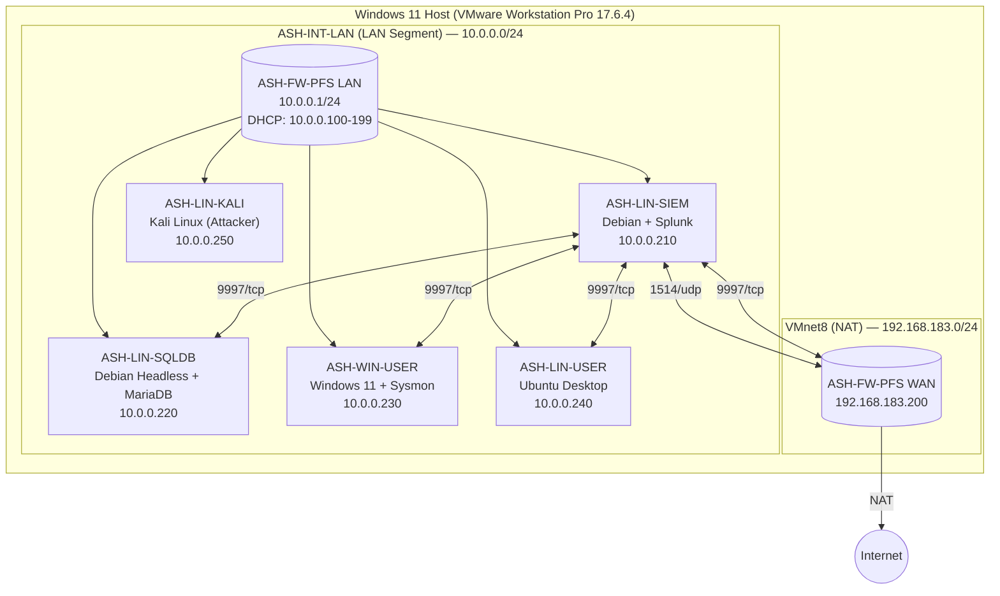

# SIEM Detection Lab - for Threat Hunting & MITRE ATT&CK Simulation

## 1. Executive Summary

This project documents an end-to-end threat detection lab built using **Splunk SIEM**, and other free, commercially available tooling. It includes the detailed configurations and logging setup for 6 network devices, including walkthroughs for configuring the Splunk Universal Forwarder (SUF). 

Once the network infrastructure is configured and baseline VM snapshots are created, we can focus on threat simulation & detection. In this lab, 5+ MITRE ATT&CK techniques are simulated across both Windows and Linux endpoints. The corresponding Splunk (SPL) detection logic is documented and implemented as custom alert rules to identify, monitor, and alert on simulated attacker activity.

## 2. Network Architecture & Topology Diagram

This project documents an end-to-end threat detection lab built using free, commercially available tooling. The environment is hosted on-prem on a single Windows 11 Home machine using VMware Workstation Pro as the Type-2 hypervisor. 

The lab consists of 6 virtual machines (VMs) in total. 
- The network firewall (`ASH-FW-PFS`) separates the network into a LAN-side and WAN-side.
- The LAN interface leads to a flat internal network (`ASH-INT-LAN`, 10.0.0.0/24) consisting of 5 endpoint VMs.
- The WAN interface (`NAT`, 192.168.183.200/24) leads out to the public internet through VMware Workstation's NAT (`VMnet8`) network.

DNS Resolution: 
- All internal hosts resolve through the pfSense DNS Resolver service at 10.0.0.1.
- External resolution forwards to Google DNS (8.8.8.8, 8.8.4.4).

| # | Device Name        | Description         |  OS                                   | LAN IP          | WAN IP               | Notes                                              |
| - | ------------------ | ----------------    | --------------------                  | --------------- | -------------------- | -------------------------------------------------- |
| 1 | **ASH-FW-PFS**     | Network Firewall    | pfSense CE (2.8.1)                    | `10.0.0.1/24`   | `192.168.183.200/24` | Syslog (RFC 5424), Suricata IDS (eve.json)         |
| 2 | **ASH-LIN-SIEM**   | Splunk SIEM Server  | Linux Debian (GNU/Linux 13, GUI)      | `10.0.0.210/24` |                      | UFW, Splunk Enterprise / Free, rsyslog             |
| 3 | **ASH-LIN-SQLDB**  | SQLDB Server        | Linux Debian (GNU/Linux 13, Headless) | `10.0.0.220/24` |                      | UFW, MariaDB, rsyslog, SUF                         |
| 4 | **ASH-WIN-USER**   | Windows Workstation | Windows 11 Enterprise                 | `10.0.0.230/24` |                      | Sysmon (SwiftOnSecurity Config), Sysinternals, SUF |
| 5 | **ASH-LIN-USER**   | Linux Workstation   | Linux (Ubuntu 24.04.4 LTS)            | `10.0.0.240/24` |                      | UFW, rsyslog, SUF                                  |
| 6 | **ASH-LIN-KALI**   | Linux Attackbox     | Linux Kali Xfce (GNU/Linux 2026.1)    | `10.0.0.250/24` |                      |                                                    |

## 3. Lab Setup and Device Configuration
## *3.1. Hypervisor - VMware Workstation Pro*

Why choose VMware Workstation Pro compared to other Type-2 Hypervisors?
- Hyper-V: Unavailable on Windows 11 Home without a Pro license upgrade.
- VirtualBox: Familiar but skipped to gain experience with the VMware ecosystem (relevant to enterprise vSphere environments).
- VMware Workstation Pro: Chosen because Broadcom made it free for personal use. Version 17.6.4 (Build 24832109) was downloaded and hash-verified via PowerShell (`Get-FileHash` with SHA256 and MD5).

Host Setup: 
- Enabled Windows Hypervisor Platform in Windows Features (required for Workstation Pro on Win11).
- Rebooted host to apply changes.

Virtual Networking: 
- NAT (`VMnet8`): `192.168.183.0/24`. Assigned to the firewall’s WAN adapter.
- LAN Segment (`ASH-INT-LAN`): Custom segment created in Workstation. All internal VMs (except the firewall’s WAN) attach here.

Snapshot Strategy:
A three-tier snapshot methodology was adopted across all VMs:
1. Base-Snapshot: OS installed, initial hardening, users created.
2. Base-Snapshot-2: Static IP assigned, IPv6 disabled, host firewall enabled, logging configured.
3. Base-Snapshot-3: Pre-detection baseline. All logs verified flowing into correct Splunk indexes.

## *3.2. Network Firewall - ASH-FW-PFS (pfSense)*

Host Setup: 
- OS: pfSense Plus Community Edition 2.8.1 (FreeBSD 15.0).
- Interfaces: `em0` = WAN; `em1` = LAN.
- LAN Setup: Static IPv4 `10.0.0.1/24`; Kea DHCP enabled (IP Range `10.0.0.100`-`199`).
- Hostname: `ASH-FW-PFS`; Domain: `lab.internal`.
- Time: UTC (`Etc/UTC`); NTP: `2.pfsense.pool.ntp.org`.
- Admin Portal: Default credentials (`admin` / `pfsense`) changed during wizard; later disabled entirely.

Hardening: 
- Disabled IPv6 globally (`System > Advanced > Networking`): unchecked “Allow IPv6”.
- Disabled DHCPv6 and Router Advertisements on LAN.
- Changed DHCP server backend from deprecated ISC DHCP to **Kea DHCP**.
- Created non-default admin user `ash` (group: `admins`); disabled login for default user `admin`.
- Enabled SSH access with `Password or Public Key` (port 22).

Firewall Rules (LAN):
| Rule | Protocol | Source | Destination | Port | Action | Status |
|---|---|---|---|---|---|---|
| Anti-Lockout | * | * | LAN Address | 443, 80, 22 | Allow | Enabled |
| Default Allow LAN | * | * | * | * | Allow | Enabled |
| Default Allow LAN IPv6 | * | * | * | * | Allow | Block | Disabled |

Firewall Rules (WAN):
- No custom rules defined for this interface.
- By default, all incoming connections on this interface will be blocked until pass rules are added. 

Suricata IDS:
- Installed Suricata package (`v7.0.8_5`) and Open-VM-Tools.
- Disabled Hardware Checksum Offloading, TCP Segmentation Offloading, and Large Receive Offloading (`System > Advanced > Networking`) to prevent Suricata packet loss.
- Added an Oinkcode for Snort rule updates.
- Enabled Suricata on both WAN and LAN in IDS (legacy) mode.
- WAN: IPS intentionally disabled to avoid self-lockout during testing.
- Troubleshooting: During setup, the firewall crashed due to swap memory exhaustion (caused by enabling too many rules). This issue was resolved by changing the Firewall VM's RAM from 1GB to 2GB, and selecting a limited ruleset (ET Open + essential categories only). 

Enable Firewall Logging and Forward Logs to SIEM:
1. *Syslog (pfSense system / firewall logs):*
   - Syslog format changed from BSD (RFC 3164) to syslog (RFC 5424) for enhanced compatibility with 'TA-pfsense' plugin.
   - Remote logging enabled and configured to forward logs to `10.0.0.210:1514/udp` (i.e. Port 1514 on the SIEM server).
     - Note: Port `514` is the default for Syslog. However, I used a non-standard port `1514` (i.e. not in `0-1024` range) instead because Splunk is running as a non-root underprivileged `splunk` user on the firewall, which doesn't have permissions to modify assignments for well known ports (`0-1024`).
   - Splunk input configured: sourcetype=`pfsense`, index=`pfsense`.
   - Installed TA-pfsense add-on on Splunk to normalize sourcetypes.

2. *Suricata EVE JSON (IDS alerts):*
   - Logs written to `/var/log/suricata/`.
   - Installed Splunk Universal Forwarder (SUF) on the firewall.
   - Created `splunk` service user and group on pfSense.
   - Used `setfacl` to grant `splunk` user read/execute access to `/var/log/suricata`.
   - Updated the inputs.conf, outputs.conf, props.conf, and transforms.conf files to reduce & tune-out log noise.
   - Monitors configured in `inputs.conf`:
     - `[monitor:///var/log/suricata/suricata_em051045/eve.json*]` → `index=suricata`, `sourcetype=suricata:wan`
     - `[monitor:///var/log/suricata/suricata_em144243/eve.json*]` → `index=suricata`, `sourcetype=suricata:lan`
   - `outputs.conf` points to `10.0.0.210:9997` (i.e. Port 9997 on the SIEM server). 
   - Added Shellcmd package to auto-start Splunk Forwarder on boot (`/opt/splunkforwarder/bin/splunk start`).
   - Added Shellcmd package to restart `syslogd` service on boot (`/usr/sbin/service/syslogd restart`) to ensure syslog forwarding persists upon firewall reboot.

## *3.3. SIEM Server - ASH-LIN-SIEM (Splunk Enterprise)*

Host Setup: 
- OS: Linux Debian (GNU/Linux 13, GUI with GNOME).
- User: ash (sudoers group).
- Static IP: `10.0.0.210/24`, Gateway: `10.0.0.1`, DNS: `10.0.0.1`.
- IPv6: Disabled via `sysctl`.

Host Firewall Rules (UFW): 
- `sudo ufw allow in 9997/tcp` — Splunk Forwarder data ingress.
- `sudo ufw allow in from 10.0.0.1 to any port 1514 proto udp` — Syslog from firewall.
- Port `8000/tcp` (Splunk Web UI) and `8089/tcp` (Splunkd management) intentionally left closed to LAN to reduce attack surface; UI accessed locally on the SIEM server only.
- Default deny incoming; default allow outgoing.

Splunk Enterprise Installation:
- Version: Splunk Enterprise `10.2.3` (`.deb` package).
- Install Path: `/opt/splunk`.
- Service Account: `splunk` user/group owns `/opt/splunk`.
- Admin Credentials: `siemadmin` / `companysplunk`.
- Boot Start: `sudo /opt/splunk/bin/splunk enable boot-start -user splunk`.
- Receiving: Enabled on port `9997/tcp` (`Splunk UI > Settings > Forwarding and Receiving`).

Indexing Strategy in Splunk:
| # | Index | Purpose | Sources |
| - |---|---|---|
| 1 | `pfsense` | Firewall (syslog) | `ASH-FW-PFS` |
| 2 | `suricata` | IDS (eve.json) | `ASH-FW-PFS` (WAN & LAN Interfaces) |
| 3 | `linux` | Linux OS | `ASH-LIN-USER`, `ASH-LIN-SQLDB` |
| 4 | `windows` | Windows OS / Sysmon | `ASH-WIN-USER` |
| 5 | `_audit` | Splunk Internal Auditing | `ASH-LIN-SIEM` |

Add-ons Installed:
- Splunk Add-on for Unix and Linux (`Splunk_TA_nix`): Deployed on forwarders and SIEM for field extraction.
- TA-pfsense: For pfSense log parsing and sourcetype assignment.

Quality of Life & Troubleshooting:
- Installed `tcpdump` to verify packet flow on ports `1514` and `9997`.
- Used `dbinspect` and `eventcount` SPL commands to monitor index sizes and event counts.
- Cleaned old event data and removed deprecated indexes to prevent double-ingestion and storage bloat.
  - `sudo /opt/splunk/bin/splunk clean eventdata -index index_name` 

## *3.4. Linux Workstation - ASH-LIN-USER (Ubuntu)*

Host Setup: 
- OS: Linux Ubuntu Desktop 24.04.4 LTS (64-bit).
- User: joej (sudoers group).
- Username: Joe Johnson.
- Static IP: `10.0.0.20/24`, Gateway: `10.0.0.1`, DNS: `10.0.0.1`.
- IPv6: Disabled.
- Tools Installed: `curl`, `vim`, `net-tools`, `traceroute`, `wget`, `htop`, `tcpdump`, `openssh-server`, `python3`, `python3-pip`, `mousepad`.
- Power Settings: Screen blank set to Never; automatic screen lock disabled.

Host Firewall Rules (UFW): 
- Explicit outbound rule: `sudo ufw allow out to 10.0.0.210 port 9997 proto tcp` (Splunk Forwarder egress).
- Default deny incoming; default allow outgoing.

Logging: 
- `rsyslog` enabled and running.
- Verified log files: `/var/log/auth.log`, `/var/log/syslog`, `/var/log/kern.log`.

Splunk Universal Forwarder (SUF) Setup: 
- Installed Splunk Universal Forwarder (SUF).
- Version: `10.2.3` Linux AMD64.
- Service Account: `splunkfwd`.
- Credentials: `splunkfw`.
- Boot Start: Enabled.
- Permissions: `setfacl` used to grant service user `splunkfwd` read access to `/var/log/`.
- Add-on: `Splunk_TA_nix` installed in `/opt/splunkforwarder/etc/apps/`.
- Updated the inputs.conf, outputs.conf, props.conf, and transforms.conf files to reduce & tune-out log noise.
- Monitors configured in `default/inputs.conf` with `sourcetype=linux` and `disabled=0`:
  - `[monitor:///var/log]` (file monitors)
  - `[script://./bin/netstat.sh]` (network connections)
  - `[script://./bin/who.sh]` (logged-in users)
  - `[script://./bin/openPorts.sh]` (open ports)
- `outputs.conf` points to `10.0.0.210:9997` (i.e. Port 9997 on the SIEM server).

Tuning Notes: 
- Disabled `ps.sh` monitoring after discovering it generated ~30% of total Linux index volume (13,280 events in a 15-minute window). Tuned `inputs.conf` to reduce noise.

## *3.5. Windows Workstation - ASH-WIN-USER (Windows 11 Enterprise)*

